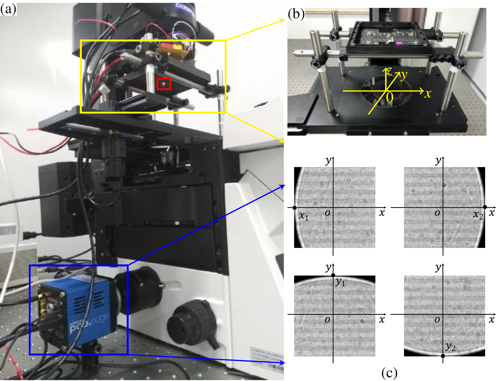
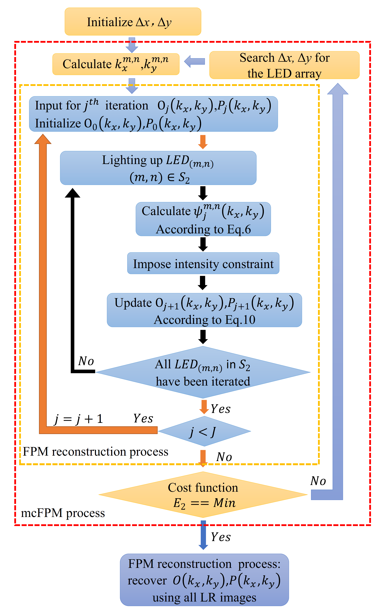
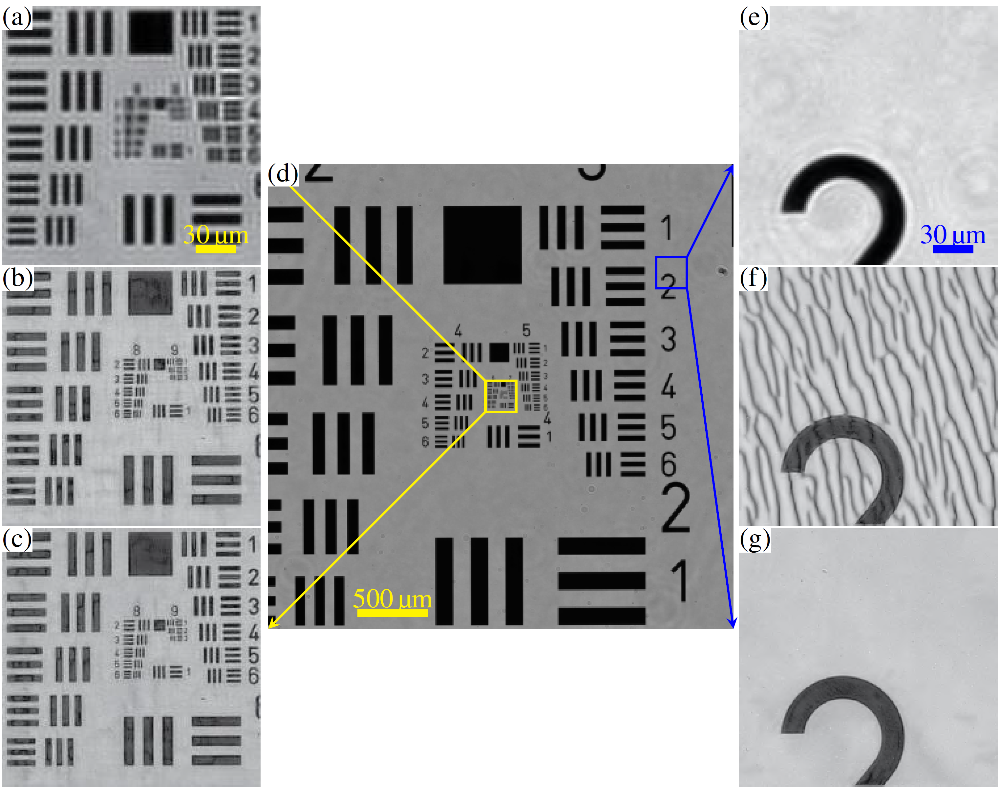

<h2 class="section-title"> Fast and robust misalignment correction of Fourier ptychographic microscopy for full field of view reconstruction  </h2>
<h5 class="pubname"> Optics Express, 2018 </h5>
<nav class="text-center" style="width: 100%">
  <a href="" class="author">Ao Zhou1</a>
  <a href="" class="author">Wei Wang1</a>
  <a href="https://ni-chen.github.io/" class="author">Ni Chen1,2,*</a>
  <a href="https://www.eee.hku.hk/~elam/" class="author">Edmund Y. Lam 3</a>
  <a href="http://oeqelab.snu.ac.kr/PROF" class="author">Byoungho Lee2</a>
  <a href="https://ni-chen.github.io/" class="author">Guohai Situ1</a>
</nav>
<nav>
 1 Shanghai Institutes of Optics and Fine Mechanics, Chinese Academy of Sciences 
  2 Seoul National University 
  3 The University of Hong Kong
</nav>

<section class="container">
<abstract>
<h5 class="section-title">  Abstract  </h5>
Fourier ptychographic microscopy (FPM) is a newly developed computational imaging technique that can provide gigapixel images with both high resolution (HR) and wide field of view (FOV). However, there are two possible reasons for position misalignment, which induce a degradation of the reconstructed image. The first one is the position misalignment of the LED array, which can largely be eliminated during the experimental system building process. The more important one is the segment-dependent position misalignment. Note that, this segment-dependent positional misalignment still exists, even after we correct the central coordinates of every small segment. In this paper, we carefully analyze this segment-dependent misalignment and find that this global shift matters more, compared with the rotational misalignments. According to this fact, we propose a robust and fast method to correct the two factors of position misalignment of the FPM, termed as misalignment correction for the FPM misalignment correction (mcFPM). Although different regions in the FOV have different sensitivities to the position misalignment, the experimental results show that the mcFPM is robust with respect to the elimination of each region. Compared with the state-of-the-art methods, the mcFPM is much faster.
  
</abstract>
</section>

<!-- Framework -->
<section class="container">
<h5 class="section-title"> Framework </h5>
<figure>
    
<figcaption>
Fig. 1: The experimental setup (a) with the installation manual of the LED array on the
microscope (b), and the adjust method of the central LED (c) along the optical axis, and the flow chart of the mcFPM (right figure).
</figcaption>
</figure>
</section>

<!-- Results -->
<section class="container">
<h5 class="section-title"> Some results  </h5>
<figure>
  
  <figcaption>
  Fig. 2: Experimental results of a USAF resolution target. Two segments (a) and (e), which are the enlargement of the parts within the yellow and blue box in the original captured image (d), and their corresponding reconstructions using the conventional FPM without position correction (b) and (f), and the proposed mcFPM (c) and (g). 
  </figcaption>
</figure>
</section>

<!-- Data -->

<!-- Downloads -->
<section class="container">
<h5 class="section-title">  Downloads </h5>

The manuscript link  | Github project link 

</section> 

<section class="container">
<h5 class="section-title"> Bibtex </h5>
<pre>
  @article{Zhou2018OE,
  title = {Fast and robust misalignment correction of {F}ourier ptychographic microscopy for full field of view reconstruction},
  author = {Ao Zhou and Wei Wang and Ni Chen* and Edmund Y. Lam and Byoungho Lee and Guohai Situ},
  journal = {Optics Express},
  year = {2018},
  volume = {26},
  number = {18},
  pages = {23661-23674},
  month = {Aug.},
  doi = {10.1364/oe.26.023661},
  }
</pre>
</section>
